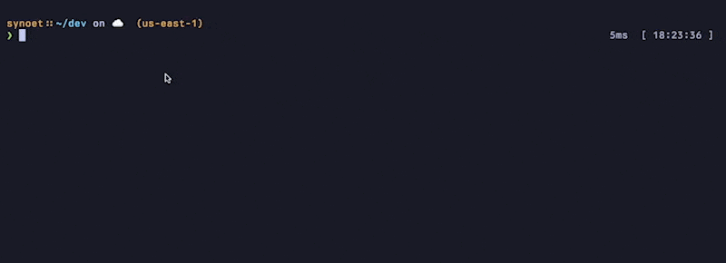

<div align="center">

# ⚡️cdwe (cd with env)
A simple configurable cd wrapper that provides powerful utilities for customizing your envionment per directory. \
*(For **ZSH** / **BASH** / **FISH** Shells)*


[Installation](#installation) •
[Usage](#usage) •
[Configuration](#configuration) •
[Uninstalling](#uninstalling)
</div>



## Features

- **Per Directory Environment Variables**  
- **Auto Load .env files in Directories**
- **Auto Execute Commands in Directories**
- **Per Directory Aliases**
- **Works with any CD like Command**

## Installation

1. **Install binary**
```bash
cargo install cdwe
```

2. **Init your shell**
```bash
cdwe init zsh # zsh shells
cdwe init bash # bash shells
cdwe init fish # fish shells
```

3. **Reload your shell and start using!**
```bash
# check that env var gets set
cdwe /Users/synoet/dev/projecta
echo $IS_DEBUG

# check that env var gets unset
cdwe ..
echo $IS_DEBUG
```

## Usage

### Defining Per Directory Env Variables
---

You can explicitly define environment variables in two ways:
```toml
[[directory]]
path = "/Users/synoet/dev/project"
vars = {"IS_DEBUG" = "true", "IS_PROD" = "false"}

# or

[[directory]]
path = "/Users/synoet/dev/project"
vars = [
    {name="IS_DEBUG", value ="true"},
    {name="IS_PROD", value="false"}
]
```
`path`: the path to your directory you are configuring

`vars`: a map of env vars to set

*By default env vars will also be loaded in subdirectories, in this example `/Users/synoet/dev/project/src` would also have `IS_DEBUG` and `IS_PROD` set*

*OR*


```toml
[[env_variable]]
name = "IS_DEBUG"
value = "true"
dirs = [
  "/Users/synoet/dev/project1",
  "/Users/synoet/dev/project2"
]
```
Here you can define one env var for multiple directories.

`name`: Is the key of the env variable

`value`: is the value of the env variable

`dirs`: Is a list of directories to load this env var for

### Loading From .env files
---
The directory object also takes a `load_from` field
```toml
[[directory]]
path = "/Users/synoet/dev/project"
vars = {"IS_DEBUG" = "true", "IS_PROD" = "false"}
load_from = [".env"]
```
`load_from`: List of .env file names to auto load in, these should be relative to the dir defined in path.

In this example we would try to load in a env file at `/Users/synoet/dev/project/.env`

*Unlike per directory env vars, env files are only loaded in the exact matching directory not in subdirectories*

**OR**

Similarly we can define a single env file for multiple directories

```toml
[[env_file]]
load_from = ".env"
dirs = [
  "/Users/synoet/dev/macro/macro-site/astro",
  "/Users/synoet/dev/macro/app-monorepo/packages/app"
]
```

### Defining Aliases Per Directory
---
Here we can define aliases that will be set and unset as functions only in specific directories

```toml
[[directory]]
path = "/Users/synoet/dev/project"
vars = {"IS_DEBUG" = "true", "IS_PROD" = "false"}
load_from = [".env"]
aliases = [
    { name = "build", commands = ["yarn cache clean", "yarn build", "yarn package"] }
]
```

Here we define a `build` alias which will live only in `/User/synoet/dev/project/*` and all subdirectories.

`aliases`: a list of aliases to define for the directory

**OR**
```toml
[[alias]]
name = "build"
commands = ["yarn cache clean", "yarn build", "yarn package"]
dirs = [
    "/Users/synoet/dev/projecta",
    "/Users/synoet/dev/projectb"
]
```
Here you are defining the same alias for multiple directories.

### Defining Auto Commands
---
Here we can define commands that will automatically run anytime we cd into a specific directory
```toml
[[directory]]
path = "/Users/synoet/dev/project"
vars = {"IS_DEBUG" = "true", "IS_PROD" = "false"}
load_from = [".env"]
aliases = [
    { name = "build", commands = ["yarn cache clean", "yarn build", "yarn package"] }
]
run = ["git fetch -p", "ls"]
```
In this case every time we enter `/Users/synoet/dev/project` cdwe will automatically run `git fetch -p` and `ls`

*Auto Commands also require an exact match and don't propogate to subdirectories*

**OR**

```toml
[[command]]
run = "git fetch -p"
dirs = [
  "/Users/synoet/dev/cdwe",
  "/Users/synoet/dev/macro/macro-api"
]
```

## Configuration 
### Global Configuration Options
```toml
[config]
# Shell (Created during cdwe init <shell>)
shell = "zsh"
# Custom CD Command (defaults to cd)
cd_command = "z"
# Show alias hints on cd
alias_hints = true
# Show env hints on cd
env_hints = true
# shoe run hints on cd
run_hints = true
```

### Example Configuration
```toml
[config]
cd_command = "z"
alias_hints = true
env_hints = true
command_hints = true
run_hints = true
shell = "zsh"

# Defined a directory
# Will have env var "TEST" set in this directory
# Will auto run "git fetch -p" whenever you cd into this dir
# Exposes the following aliases in that directory and sub dirs
[[directory]]
path = "/Users/synoet/dev/cdwe"
vars = { "TEST" = "testing" }
runs = ["git fetch -p"]
aliases = [
  { name = "build", commands = ["cargo build --release"]},
  { name = "run", commands = ["cargo run"]},
  { name = "ci", commands = ["cargo fmt", "cargo test"]}
]

# sets the "ENV_VAR" env var in the following directories
[[env_variable]]
name = "ENV_VAR"
value = "THIS IS A TEST"
dirs = [
  "/Users/synoet/dev/cdwe",
  "/Users/synoet/dev/ballast"
]

# auto loads from .env file in following directories
[[env_file]]
load_from = ".env"
dirs = [
  "/Users/synoet/dev/cdwe",
  "/Users/synoet/dev/project-api"
]

# will auto run the command "git fetch -p" in the following directories
[[command]]
run = "git fetch -p"
dirs = [
  "/Users/synoet/dev/cdwe",
  "/Users/synoet/dev/project-api"
]
```

## Uninstalling
1. Run cdwe-remove to clean up all shell artifacts
```bash
cdwe-remove #removes the `source <output>` from your .zshrc/.bashrc/.fish

zsh #reload your shell, use bash or fish if you use those.
```

2. Uninstall binary
```bash
cargo uninstall cdwe
```

